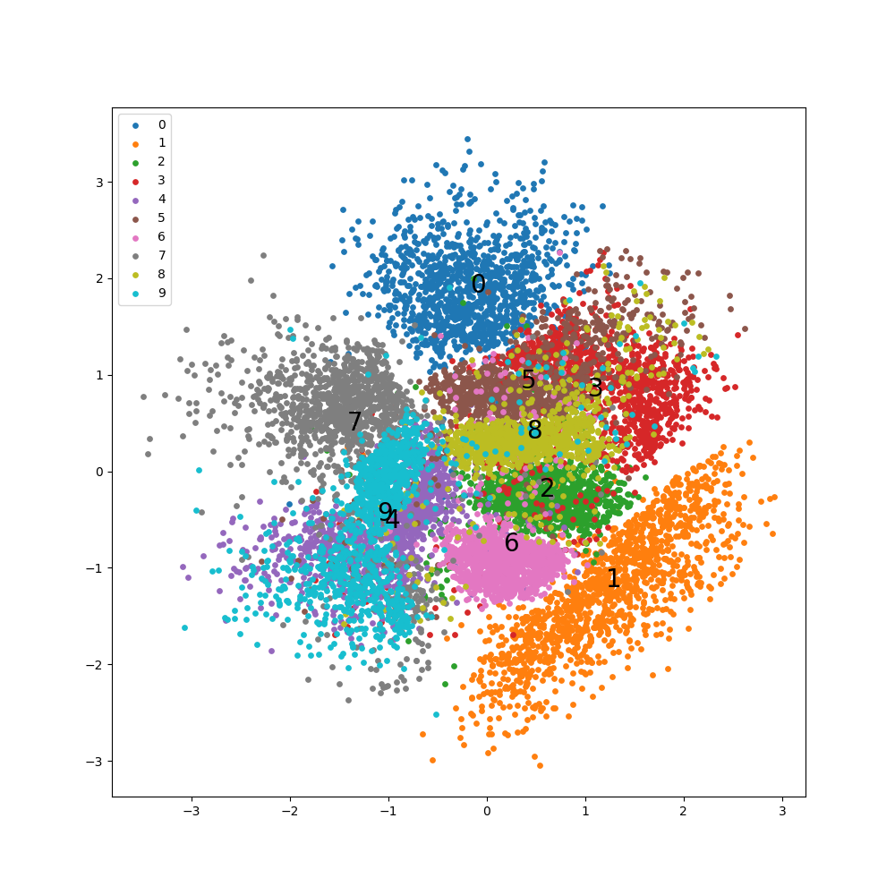

# Autoencoder, Variational AE, Conditional VAE


## Environments

- [requirements.txt](https://github.com/yuzoo0226/singularity_definition_zoo/blob/main/016_gaussian_splatting/apptainer/requirements.txt)
- [Apptainer](https://github.com/yuzoo0226/singularity_definition_zoo/tree/main/016_gaussian_splatting/apptainer)

## How to train VAE

- 以下のコマンドで学習が開始されます．
- 100epochごとに結果が保存され，matplotlibで潜在空間が可視化されます．

```bash
cd autoencoder
python autoencoder_utils.py -m vae
```



## How to train CVAE

```bash
cd autoencoder
python autoencoder_utils.py -m cvae
```

## How to launch GUI

```bash
python main_gui.py
```
