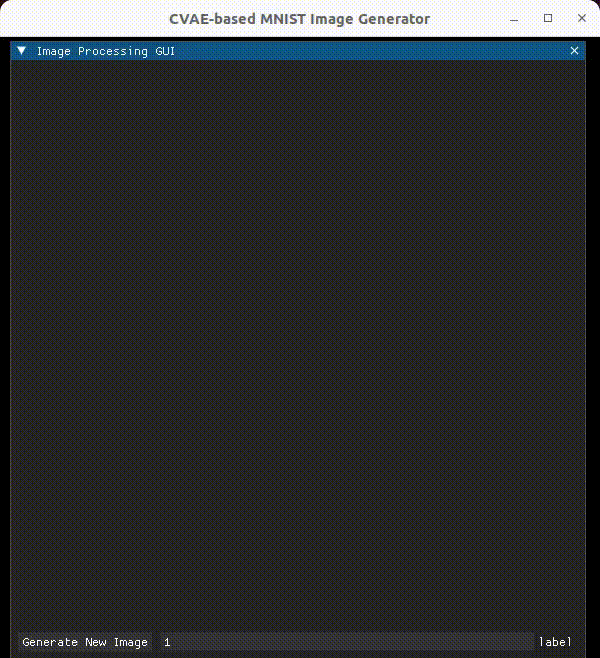

# Autoencoder, Variational AE, Conditional VAE



## Environments

- [requirements.txt](https://github.com/yuzoo0226/singularity_definition_zoo/blob/main/016_gaussian_splatting/apptainer/requirements.txt)
- [Apptainer](https://github.com/yuzoo0226/singularity_definition_zoo/tree/main/016_gaussian_splatting/apptainer)

## How to launch

```bash
python main_gui.py
```
